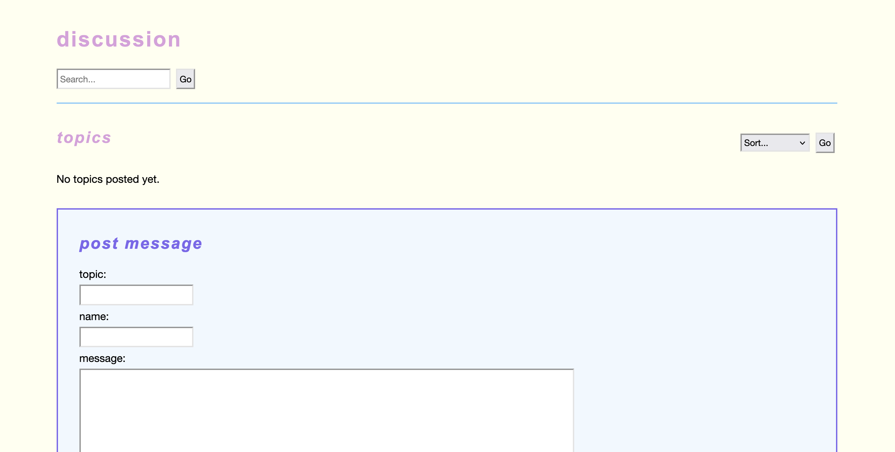

# About

A pure-php, file-based discussion forum toy, created from first principles.

Based on a chapter of "PHP Programming with MySQL" by Don Gosselin.

Inspired by the great 4chan hack of 2025.

# TODO

- be consistent with search, sort and render, whether in models or utilities
- clearer commentrary
- take opportunities to delete duplicated code
- a general error view to render
- improve the sorter
- move data directory out of server tree
- escape characters are saved in storage...

# Notes

## setting-up

the `data` directory needs to be owned by `www-data` for read-write.

# Sample

